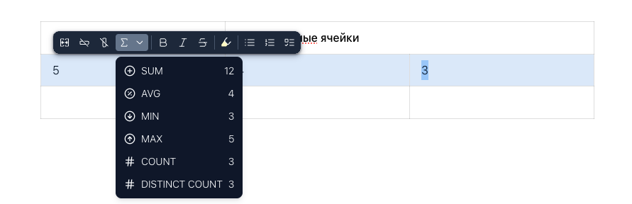
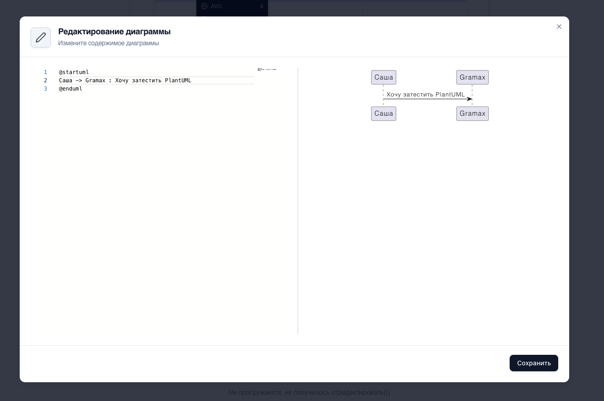
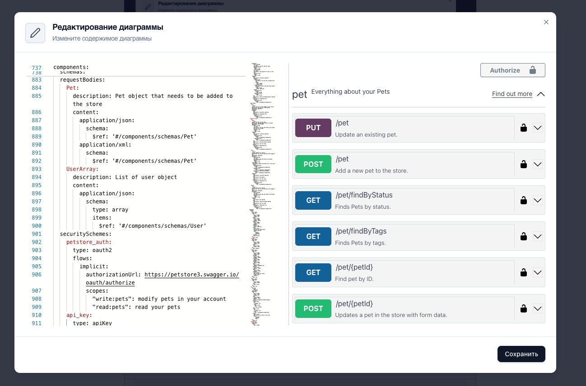

Все еще знакомлюсь с Gramax

## Заголовок 2 уровня

### Заголовок 3 уровня

#### Заголовок 4 уровня

**Жирный**

*Курсив*

~~Зачеркнутый~~

<highlight color="lemon-yellow">Выделенный</highlight>

Список:

-  Пункт 1

-  Пункт 2

-  Пункт 3

Нумерованный список:

1. Пункт

2. Пункт

3. Пункт

Список задач:

* [x] Затестить ненумерованный список

* [x] Затестить нумерованный список

* [x] Затестить список задач

```javascript
console.log('Привет, Gramax')
```

<table header="row">
<tr>
<td>

Заголовок

</td>
<td colspan="2">

Смердженные ячейки

</td>
</tr>
<tr>
<td>

5

</td>
<td>

4

</td>
<td>

3

</td>
</tr>
<tr>
<td>


</td>
<td>


</td>
<td>

 

</td>
</tr>
</table>

{width=891px height=288px}

<note type="quote">

Умная цитата

</note>

<note type="info">

Информация

</note>

<note type="tip">

Совет

</note>

<note type="lab">

Примечание

</note>

<note>

Предупреждение

</note>

<note type="danger">

Ошибка

</note>

<drawio path="./dochernayaya-stranica.svg" title="Не прогружается, не получилось отредактировать(((" width="211px" height="101px"/>

<plant-uml path="./dochernayaya-stranica.puml" width="266px" height="120px"/>

{width=1319px height=877px}

<openapi src="./dochernayaya-stranica.yaml" flag="true"/>

{width=1298px height=856px}

<tabs>

<tab name="Вкладка 1">

Ляляля

</tab>

<tab name="Вкладка 2">

Ляляляляля

</tab>

<tab name="Вкладка 3">

Лялялялялляляляляляля

</tab>

</tabs>

<view display="List"/>

[Hao Qiang, Tsikerdekis Michail - Grokking Relational Database Design - 2025.pdf](<./Hao Qiang, Tsikerdekis Michail - Grokking Relational Database Design - 2025.pdf>)

<video path="https://www.youtube.com/watch?v=uG2jjvSfJAQ"/>

Какие-то иконки:

<icon code="airplay"/> <icon code="album"/> <icon code="chart-pie"/>

[27\.02.2026, 15.56-2.wav](<./27.02.2026, 15.56-2.wav>)