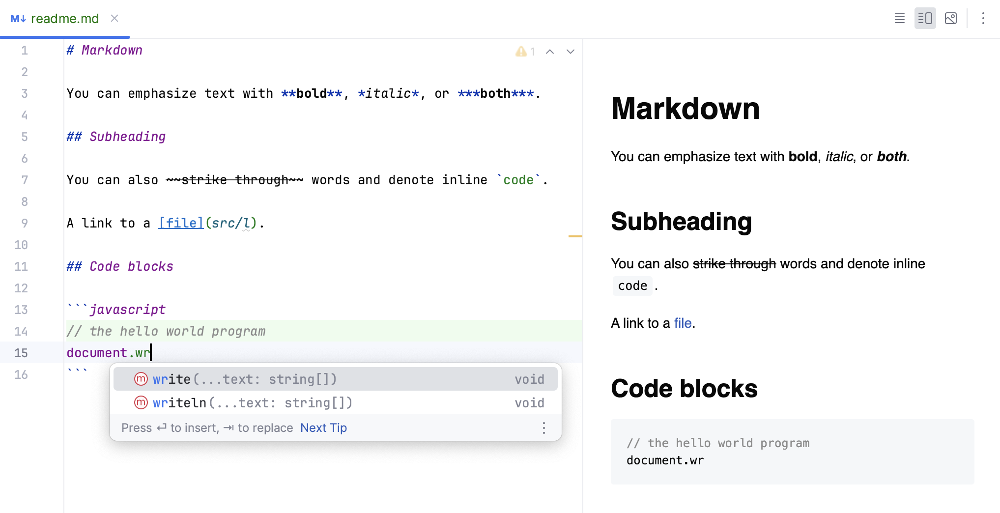
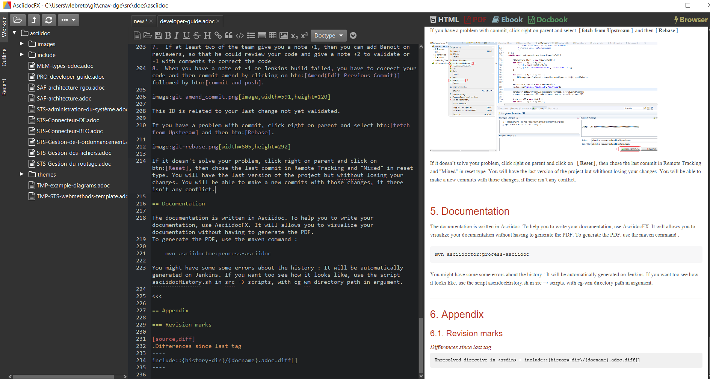
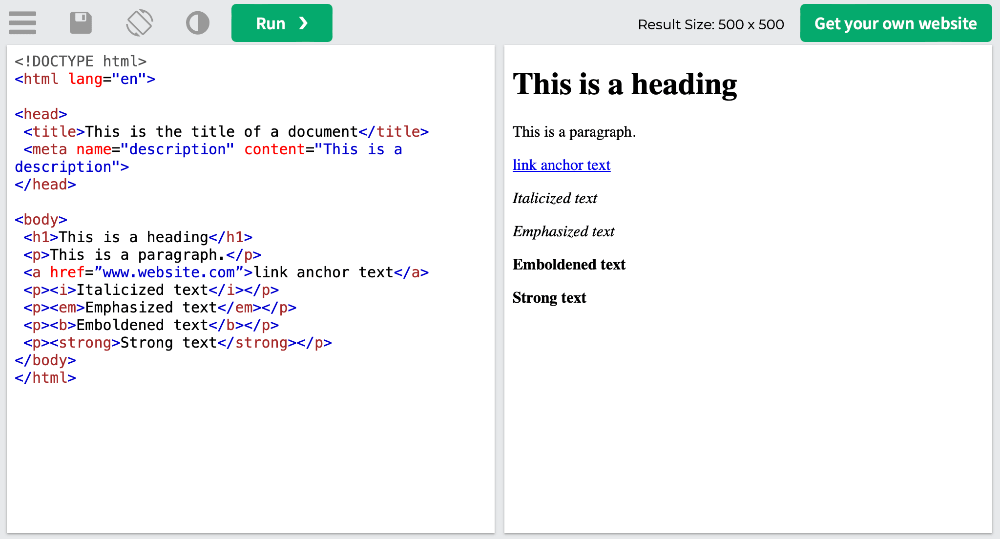
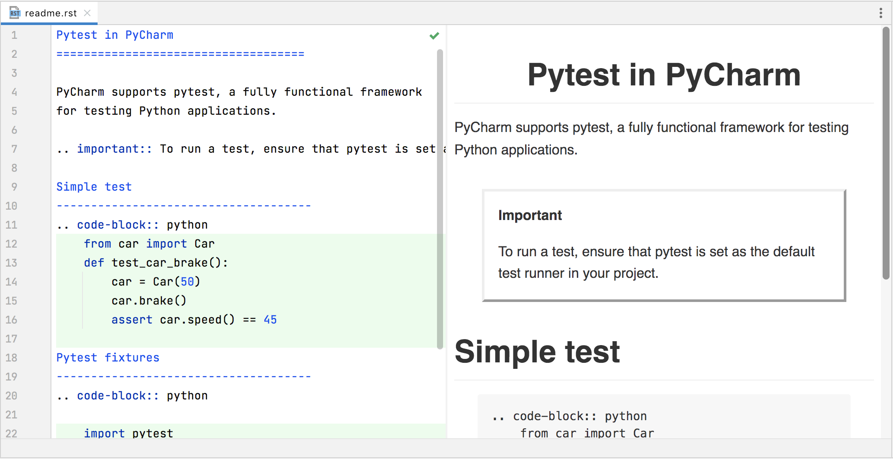
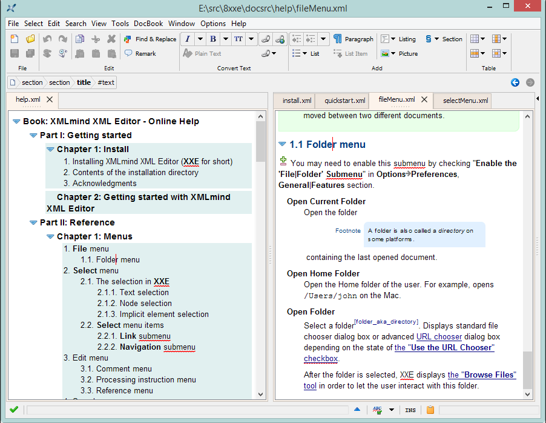
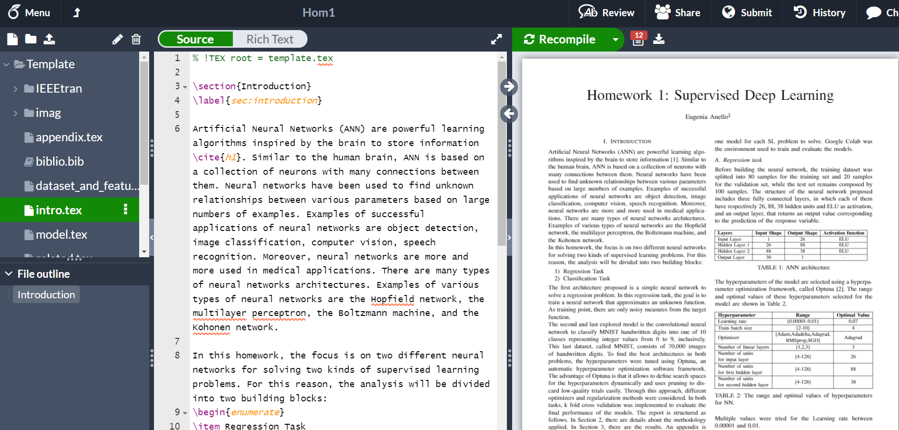

## Markdown (.md)

Простой, минималистичный язык разметки.

{width=2035px height=1044px}

## AsciiDoc (.adoc)

Более мощный язык разметки, который поддерживает больше возможностей для ведения технической документации.

{width=1890px height=1011px}

## HTML (HyperText Markup Language)

Основной язык разметки для создания веб-страниц и веб-документации.

{width=2048px height=1104px}

## reStructuredText (.rst)

Поддерживает более сложные структуры: оглавление, перекрёстные ссылки, индексы

{width=2068px height=1064px}

## DocBook

Специализированный XML-формат для технической документации и книг.

{width=902px height=698px}

## LaTeX (TeX)

Мощная система верстки для создания научных, технических и математических документов.

{width=1880px height=901px}