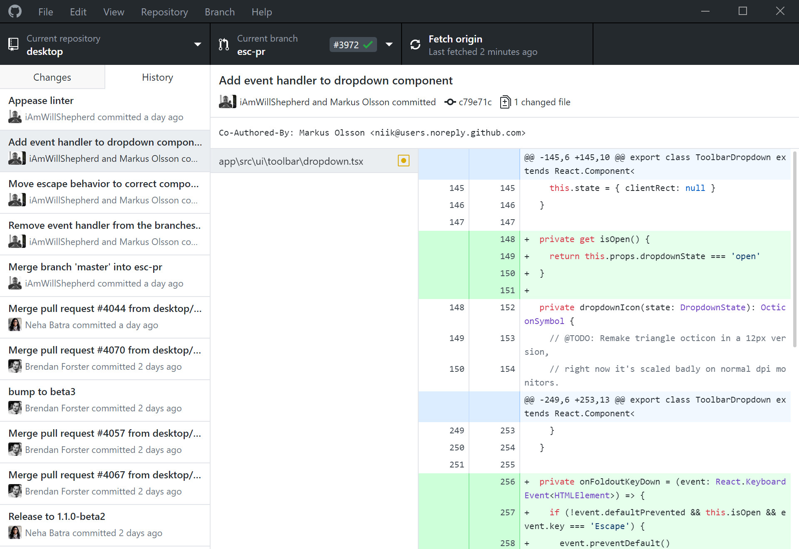
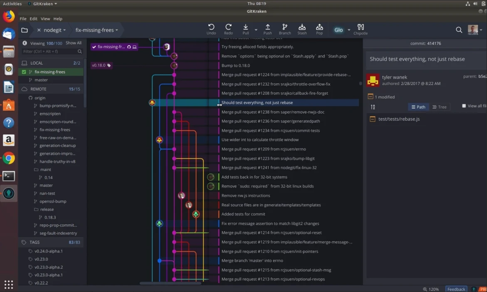

## GUI (Graphical User Interface)

<note type="info">

Визуальные приложения, в которых операции Git выполняются через кнопки, меню и drag-&-drop.

</note>

| ✅                                                              | ❌                                               |
|----------------------------------------------------------------|-------------------------------------------------|
| Интуитивная наглядность: видно ветки, дельты, дерево коммитов. | Не всегда доступны все продвинутые команды Git. |
| Быстрый старт для новичков.                                    | Зачастую медленнее.                             |

{width=1920px height=1320px}

{width=1171px height=702px}

## CLI (Command-Line Interface)

<note type="info">

Работа с Git через текстовый терминал с использованием набора команд

</note>

| ✅                                         | ❌                                          |
|-------------------------------------------|--------------------------------------------|
| Полный контроль над всеми функциями Git.  | Повышенный уровень сложности для новичков. |
| Скорость работы над рутинными операциями. | Требует запоминания синтаксиса и опций.    |