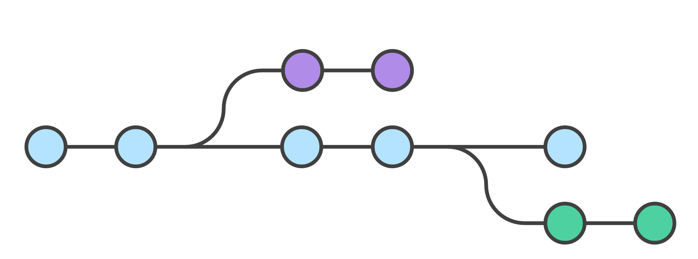
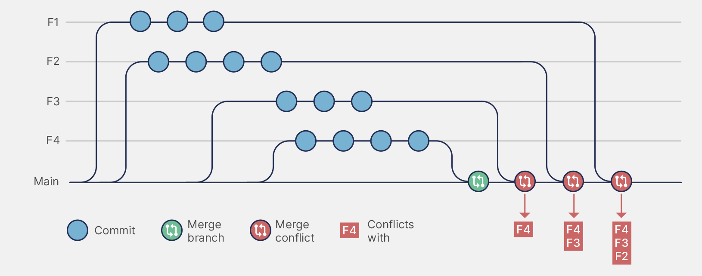

## Основной flow

<plant-uml path="./kak-vse-ustroeno.puml" width="857px" height="63px"/>

<highlight color="peach">**Рабочая директория (Working Directory)**</highlight> - это папка на локальной машине, где находятся все файлы проекта в текущем состоянии: те, что были созданы, изменены или удалены.

<highlight color="peach">**Индекс (Staging Area)**</highlight> - промежуточная область, в которую попадают именно те изменения, которые нужно зафиксировать в следующем коммите.

*Зачем нужен индекс:*

-  Позволяет точно контролировать, какие изменения попадут в следующий коммит.

-  Можно подготовить коммит из части файлов или даже части изменений в одном файле.

-  Позволяет разделять логически несвязанные изменения на отдельные коммиты.

<highlight color="peach">**Коммит (commit)**</highlight> - зафиксированное состояние проекта на определённый момент времени.

## Работа с ветками

<highlight color="peach">**Ветка **</highlight>\- отдельная линия разработки.

<highlight color="peach">**Технически:** ветка</highlight> - это переменная (указатель) в Git, указывающая на конкретный коммит. При создании новой ветки, создается новый указатель. Когда разработчик делает коммиты в этой ветке, указатель смещается вперёд по цепочке коммитов.

<highlight color="peach">**HEAD**</highlight> - указатель на текущую активную ветку или конкретный коммит, с которым производится работа на текущий момент.

{width=2686px height=1001px}

*Зачем нужно ветвление:*

-  Безопасность: по умолчанию есть главная ветка (main или master), разработка новых функций и экспериментов ведется в отдельных ветках.

-  Понятность: по названию ветки сразу видно, над чем велась работа - принято называть ветки по номеру задачи в JIRA.

-  Гибкость: при необходимости легко вернуть изменения, просто не вливая ветку.

<highlight color="peach">**Конфликт**</highlight>\- ситуация, когда Git не может автоматически объединить изменения из разных веток, потому что они затрагивают одни и те же строки в одних и тех же файлах.

*Когда возникает конфликт:*

-  При слиянии (merge) двух веток, если обе изменяли одну и ту же часть файла.

-  При ребейзе (rebase), когда изменения "переписываются" поверх других.

-  При стягивании изменений (pull), если локальные изменения противоречат удалённым.

{width=1630px height=642px}