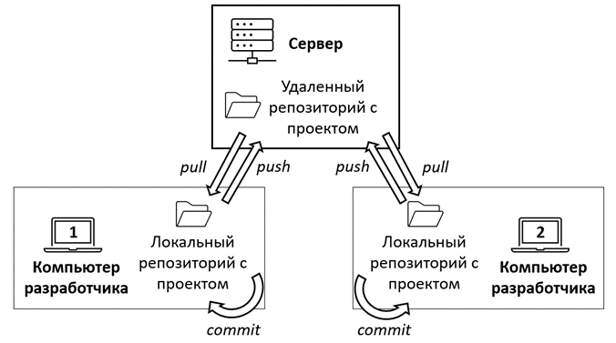

## Репозиторий (repo/repository)

*Структура, в которой хранится весь проект, включая его историю изменений, файлы, папки и метаданные.*

### Локальный репозиторий (local)

*Находится на компьютере пользователя и содержит все данные проекта: рабочие файлы, скрытую папку .git с историей коммитов, ветками, тегами и настройками.*

### Удаленный репозиторий (remote)

*Размещён на сервере (например, GitHub, GitLab, Bitbucket) и используется для совместной работы. Является центральной точкой синхронизации между несколькими локальными репозиториями.*

{width=676px height=377px}