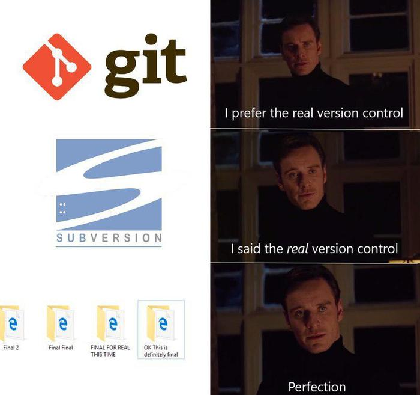

[Интерактивный онлайн-тренажер для изучения команд Git](https://learngitbranching.js.org/?locale=ru_RU)

[Статья "История систем управления версиями"](https://habr.com/ru/articles/478752/)

[Статья "GIT изнутри"](https://habr.com/ru/articles/478752/)

[Статья "30 команд Git, необходимых для освоения интерфейса командной строки Git"](https://habr.com/ru/companies/ruvds/articles/599929/)

[Видео "Что такое Git за 8 минут: Объясняем на пальцах"](https://www.youtube.com/watch?v=G4f9OH4IQE8)

[Видео "Git-объекты / Как Git работает изнутри?"](https://www.youtube.com/watch?v=wR0Nvtd-2yY)

{width=700px height=657px}