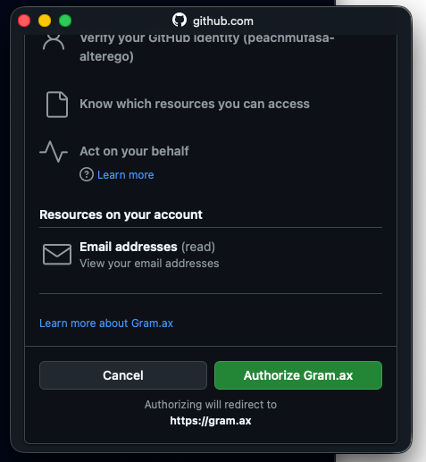

## Установка Git

<https://git-scm.com/install/windows>

## Регистрация в GitHub

<image src="./_index.png" crop="0,0,100,100" width="563px" height="88px" float="left"/>

Регистрируемся на GitHub. Если есть учетка, отлично, давай подождем тех, у кого ее нет.

## Загрузка каталога

1. Перейти по ссылке [https://app.gram.ax/github.com/peachmufasa/plug-in-5/instruction/-](https://app.gram.ax/github.com/peachmufasa/plug-in-5/instruction/-)

2. Нажать «Загрузить»

   {width=606px height=297px}

3. Нажать «Добавить хранилище»

   {width=588px height=252px}

4. Нажать «Войти в GitHub»

   {width=606px height=421px}

5. Нажать «Authorize Gram.ax»

   {width=477px height=517px}

6. Нажать «Добавить»

   {width=591px height=413px}

## Клонирование репозитория (опционально)

<note type="tip">

Можно склонировать репозиторий и открыть, например, в Visual Studio Code

</note>

1. Открыть терминал и перейти в ту папку, в которой хочется положить проект ИЛИ открыть терминал из папки, в которой хочется положить проект.

2. Ввести команду:

   ```
   git clone git@github.com:peachmufasa/plug-in-5.git
   ```

## SSH-ключ

<note>

Это нужно, чтобы можно было склонировать репозиторий себе на компьютер

</note>

[Инструкция с сайта GitHub](https://docs.github.com/ru/authentication/connecting-to-github-with-ssh/generating-a-new-ssh-key-and-adding-it-to-the-ssh-agent)

<tabs>

<tab name="MacOS">

1. Открыть терминал

2. Вставить в терминал:

   ```
   ssh-keygen -t ed25519 -C "your_email@example.com"
   ```

   *(заменить* [`your_email@example.com`](mailto:your_email@example.com) *на свою почту)*

   Enter file in which to save the key… - нажимаем Enter

   Enter passphrase for… - нажимаем Enter

   Enter same passphrase again - нажимаем Enter

3. Вставить в терминал:

   ```
   ssh-add ~/.ssh/id_ed25519
   ```

4. Вставить в терминал:

   ```
   cat ~/.ssh/id_ed25519.pub
   ```

   Скопировать ключ `ssh-ed25519 <…>` [`your_email@example.com`](mailto:your_email@example.com)

5. Добавить SSH-ключ в GitHub

   <image src="./_index-9.png" crop="0,0,100,100" objects="annotation,92.2743,21.1753,Тык сюда,top-left" width="2698px" height="1156px" float="center"/>

</tab>

<tab name="Win">

1. Открыть PowerShell

2. Вставить в терминал:

   ```
   ssh-keygen -t ed25519 -C "your_email@example.com"
   ```

   *(заменить* [`your_email@example.com`](mailto:your_email@example.com) *на свою почту)*

   Enter file in which to save the key… - нажимаем Enter

   Enter passphrase for… - нажимаем Enter

   Enter same passphrase again - нажимаем Enter

3. Вставить в терминал:

   ```
   Get-Service ssh-agent | Set-Service -StartupType Automatic
   Start-Service ssh-agent
   ```

4. Вставить в терминал:

   ```
   ssh-add $env:USERPROFILE\.ssh\id_ed25519
   ```

5. Добавить ключ в буфер обмена:

   ```
   Get-Content $env:USERPROFILE\.ssh\id_ed25519.pub | Set-Clipboard
   ```

6. Добавить SSH-ключ в GitHub

   <image src="./_index-10.png" crop="0,0,100,100" objects="annotation,91.0156,19.3146,Тык сюда,top-left" width="2760px" height="1154px" float="center"/>

</tab>

<tab>


</tab>

</tabs>

## 