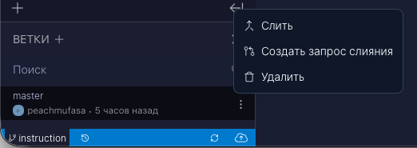
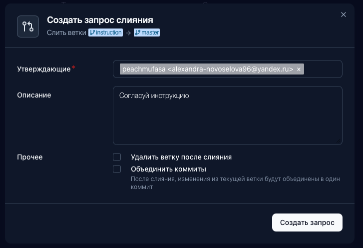
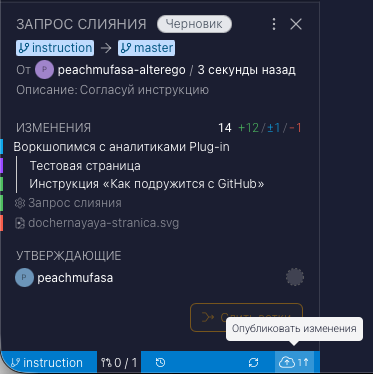
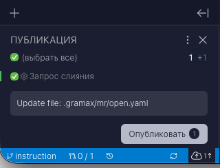
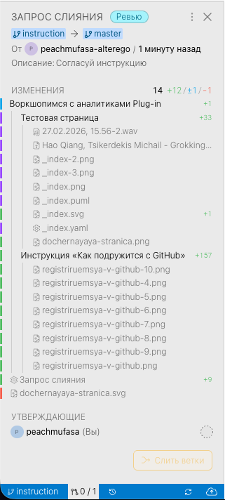
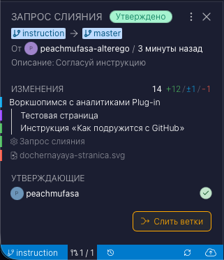

1. Мы закончили работу в своей ветке. Теперь нажимаем «Создать запрос слияния» -- это как сказать команде: «Я всё сделал, проверьте и заберите мои изменения в основной проект».

   {width=522px height=185px}

Выбираем того, кто будет проверять (утверждающий), и пишем понятное описание -- чтобы ревьювер сразу понимал, что именно мы сделали.

{width=727px height=496px}

1. Запрос создан, но пока он в статусе «Черновик» - изменения еще не опубликованы в Git. Чтобы отправить наши правки на сервер и сделать запрос доступным для ревьювера, необходимо нажать на кнопку «Опубликовать изменения», далее «Опубликовать».

   {width=373px height=374px}

   {width=320px height=244px}

2. Ревьювер видит все изменения в удобном виде: какие файлы добавлены, какие изменены. Можно открыть любой файл и посмотреть, что конкретно поменялось - прямо как в обычном код-ревью.

   {width=321px height=712px}

3. Статус изменился на «Утверждено» - ревьювер проверил и всё одобрил. Теперь доступна кнопка «Слить ветки». Нажимаем её, чтобы добавить нашу документацию в основную ветку проекта.

{width=321px height=373px}